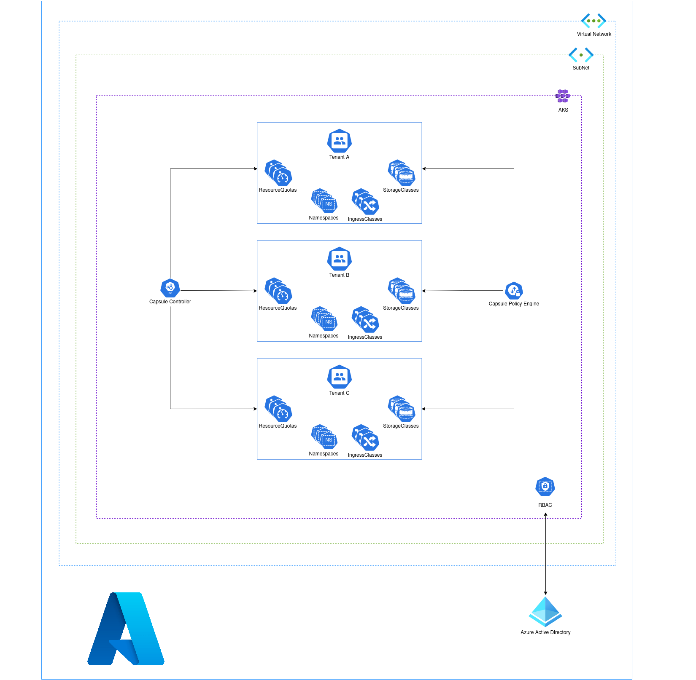

# Capsule over AKS (CoAKS) Baseline Architecture
This reference implementation introduces the recommended starting (baseline) infrastructure architecture for implementing a multi-tenancy [Azure AKS](https://azure.microsoft.com/services/kubernetes-service) Kubernetes cluster using the [Capsule Operator](https://projectcapsule.dev/). 

This implementation and document are meant to guide Azure users through the process of getting this secure baseline infrastructure deployed and understanding its components. The implementation presented here is the minimum recommended baseline for most AKS clusters. This implementation integrates with other Azure services that will provide a network topology that will support multi-regional scenarios, and keep the in-cluster traffic secure as well. This architecture should be considered your starting point for the pre-production and production stages.

## Use Case for CoAKS

Large organizations with several business lines and multiple development teams require to keep isolation between the units to control the resources assigned and consumed by each team. Governance and policy requirements as well as geographical restrictions and privacy limitations, require the separation of the infrastructures used by different teams.

The abundance of Kubernetes Cluster Management tools leads to creating multiple clusters for each team. As the number of clusters grows, the management and operational hurdles increase proportionally leading to a _cluster sprawl_ phenomenon. Maintaining and operating multiple clusters across teams and divisions can complicate further the sprawl. 

This problem points us to a different approach by creating a shared multitenant environment and this is the purpose of [Capsule Operator](https://projectcapsule.dev/), an Open Source CNCF Incubating Project. Kubernetes multitenancy is an alternative to creating multiple dedicated clusters where only a few clusters can serve multiple teams. In Kubernetes, multitenancy is hard because of the flat nature of namespaces. Capsule solves the problem by aggregating multiple namespaces and enforcing each tenant within robust policy-driven boundaries.

In this document, we are going to work through an example energy company called **Energy Corp** which is building its own PaaS on Azure AKS to serve multiple lines of business. Each line of business has its team of engineers that are responsible for the development and the operations of their digital products. Currently, they have two business units: **Solar** and **Eolic** but other units will be added as the company grows.

[Azure AKS](https://docs.microsoft.com/azure/aks/) will be used to provide a Kubernetes cluster and it will be integrated with Microsoft Entra ID to ensure a robust authentication and authorization mechanism.

## Cloud Architecture

## Prerequisites

We are going to mainly use the following tools:

* [Azure CLI](https://docs.microsoft.com/cli/azure/install-azure-cli)
* [kubectl](https://kubernetes.io/docs/tasks/tools/)
* [kubelogin](https://github.com/Azure/kubelogin)
* [Helm](https://helm.sh/docs/intro/install/)

## Steps

The material here is relatively dense. We strongly encourage you to dedicate time to walk through these instructions, with a mind to learning. We do NOT provide any "one-click" deployment here. However, once you've understood the components involved it is encouraged that you build suitable, auditable GitOps deployment processes around your final infrastructure.

1. [AKS Creation](guides/01-create-aks-with-add.md)
2. [Capsule Installation](guides/02-capsule-installation.md)
3. [Capsule Proxy Installation](guides/03-capsule-proxy-installation.md)
4. [Setup a Multitenancy Environment](guides/04-multitenant-environment.md)
5. [Setup Kubernetes Dashboard](guides/05-kubernetes-dashboard.md)
6. [Clenup](guides/10-cleanup.md)

## What’s next

[Let's start building the infrastructure](guides/01-create-aks-with-add.md)
